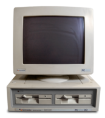

# Retroinformatica   

### Bienvenido a la página de documentación de <strong>Retroinformática</strong>

#### Estructura

    mkdocs.yml    # Archivo de configuración.
    docs/
        index.md  # Página inicial.
        about.md  # Página sobre cómo hemos modificado el footer.
        pc_anos60.md # Documentación sobre ordenadores de los años 60.
        pc_anos70.md # Documentación sobre ordenadores de los años 70.
        pc_anos80.md # Documentación sobre ordenadores de los años 80.

> <em>Supuestamente el cerebro humano es algo parecido a una libreta que se adquiere en la papelería: muy poco mecanismo y muchas hojas en blanco.</em> - Alan Turing