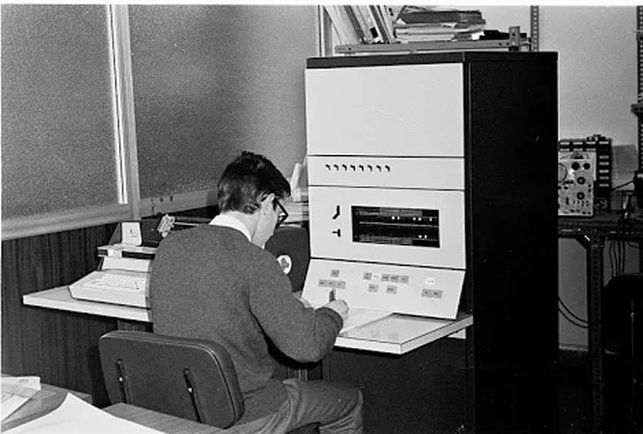

# Ordenadores de los años 60

    * Datasaab D2 (1960)
    * BRLESC I (1962)
    * Honeywell 200 (1963)
    * UNIVAC 1108 (1964)

### Curiosidad

#### En 1966 nacía Factor-P, considerado el primer ordenador fabricado en España. Estaba inspirado en una máquina de Philips para hacer facturas que había entusiasmado a Joan Majó, cofundador de la pionera compañía Telesincro y ministro de Industria y Energía casi dos décadas después. Gracias a Jordi Vidal, un maestro del ‘hardware’, la compañía barcelonesa desarrolló una familia de miniordenadores que se hicieron su hueco en las oficinas. Uno de ellos, el Factor-S, era ya una moderna máquina que incluía un revolucionario precursor del disco duro y plantó cara a las multinacionales extranjeras en el mercado español. 

 
