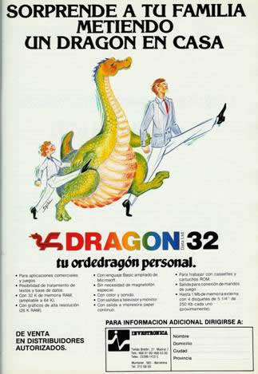

# Ordenadores de los años 80

    * MSX (1983)
    * Comodore Amiga (1985)
    * Spectrum Sinclair (1982)
    * Amstrad CPC (1984)

### Curiosidad

#### La primera fábrica de ordenadores en España se estableció en Cáceres, estando la oficina central de Dragon en Madrid. Pronto comenzaron las negociaciones con los poderes públicos, y el Ministerio de Educación de España decidió crear el Proyecto Atenea cuyo propósito era informatizar las escuelas públicas del país. El Dragon tenía todas las papeletas para ser el ordenador candidato, gracias al modelo Dragon 200, de 64kb de RAM. Entonces ¿qué falló? Un aparato tecnológico vale tanto como su software disponible, y aquí el Dragon se encontró con clara desventaja frente al Commodore64, el Spectrum y el Amstrad. Los primeros juegos y programas tenían un gran nivel, como la conversión de la recreativa Moon Patrol, pero en su ciclo final ya se vendían hasta juegos comerciales hechos en Basic. Tecnológicamente también se estaba quedando obsoleto frente a sus rivales, y Eurohard no añadió grandes mejoras con respecto al Dragon original. 

 